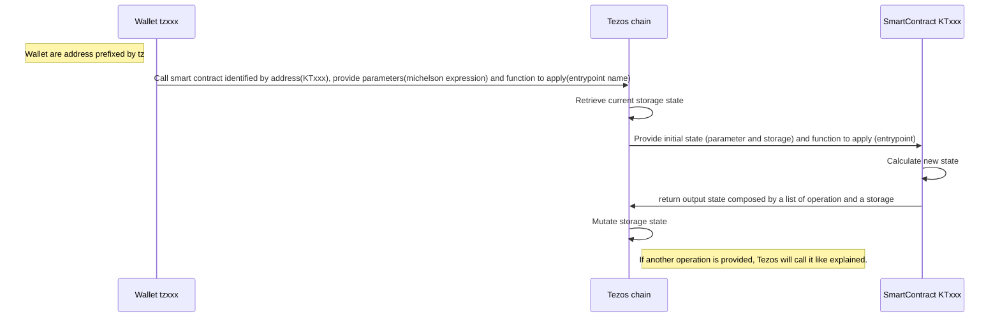

# Intezos

To follow this tutorial, create a new repo, source are the correction. 

## Goal 
Transfer crypto currency throught [interac e-transfer](https://www.interac.ca/en/consumers/products/interac-e-transfer/) process, using a secret question.

You send tokens to someone and lock them with a couple of question/answer. If the declared receiver can find the answer, so he can claim tokens, you still able to redeem the money if it has not been retrieved yet

## Technologies

WebApp : Using Typescript (and your favorite framework)

Contract : Using Ligo

# 1. Initialize repository
## You will learn
- What is Ligo
- What is Taqueria
- What is Taquito
- What is octez-client
- How to create a starter repository
- Initialize a contract

## Installation
### Install octez-client
You can download the binaries XXX-octez-client [here](https://gitlab.com/tezos/tezos/-/packages/13480737)

Or [with package manager follow](https://wiki.tezos.com/build/clients/installation-and-setup)
### Install [node and npm](https://docs.npmjs.com/downloading-and-installing-node-js-and-npm)

Useful to develop your webapp, also used by taqueria.

### Install [ligo](https://ligolang.org/docs/intro/installation?lang=jsligo)

The langage to create smart contract on Tezos. [Ligo](https://ligolang.org/docs/intro/introduction?lang=jsligo) is a strongly typed and testable language with a low footprint which compile into [michelson](https://www.michelson.org/).  

Michelson is the langage understood by [Tezos](https://tezos.com/).

### Install [taqueria](https://taqueria.io/docs/getting-started/installation/)

Improve development experience by managing development lifecycle with taqueria.
Today Taqueria is a beta, mean buggy, so we will not use every features.

Taqueria run ligo via docker, to use wished version run :  
```shell
# Replace $VERSION by the version targeted 
export TAQ_LIGO_IMAGE=ligolang/ligo:$VERSION
```

### Vscode plugin

To facilitate your experience, we recommand the usage of [ligo vscode plugin](https://marketplace.visualstudio.com/items?itemName=ligolang-publish.ligo-vscode)

---
## Startup

```shell
taq init
```

Let's explain a bit what is inside taq'ified folder (contracts) :
- `.taq` : where [taqueria](https://taqueria.io/docs/) configuration file are
- `artifacts` : Where your compiled [michelson](https://tezos.gitlab.io/active/michelson.html) will be generated
- `contracts` : The folder where your contracts sources have to be.

---
## Initialize your first contract : 
To plug taqueria with ligo let's install a plugin : 
```shell
taq install @taqueria/plugin-ligo
```

[This plugin](https://taqueria.io/docs/plugins/plugin-ligo/) provides tasks to work with LIGO smart contracts such as compiling and testing

Run 
```shell
taq create contract intezos.jsligo
```

It should generate a file in contracts named `intezos.jsligo` filled with a template for a smart contract counter where 3 action are available :
- Increase
- Decrease
- Reset 

🚧 Taqueria is not up to date and this provided template is obsolete, the new one will be the code below, copy paste content to replace existing one 🚧
```typescript
/*
 A type storage, representing stored data in you SC(smart contract)
*/
type storage = int;

/*
An entry-point is a pure function that can be formalized as :
[list<operation>, storage] = f(parameter, storage)
where :
- f is the entry-point function that is called
- parameter contains the inputs that are sent by the caller when the contract is called
- storage is the state of the storage. The input is the current state of the storage, and it outputs the next state
- list<operation> is a list of commands that will be executed by the block chain (for instance transfers…)

Entrypoint are tag with the keyword @entry
*/


@entry
const increment = (delta : int, store : storage) : [list<operation>, storage] =>
// Empty list mean there is no other invokation, the second element is the new state of the storage
  [list([]), store + delta];

@entry
const decrement = (delta : int, store : storage) : [list<operation>, storage] =>
  [list([]), store - delta];

/* 
The unit type in Michelson or LIGO is a predefined type that contains only one value that carries no information. It is used when no relevant information is required or produced.

Also _ which can be used as prefix of variable name like on _parameter, explain to compiler than this value is not used later. 
*/
@entry
const reset = (_parameter : unit, _storage : storage) : [list<operation>, storage] =>
  [list([]), 0];
```

Let's focus a bit on `unit` to bring a key notion of JSLigo and smart contract. 
In JsLIGO, the unique value of the unit type is unit.

You can assimilate it to data type void/null value but that's not true unit is a defined value, defined as unit and can only be defined as unit. Why ? Because Ligo still a functionnal language

Smart contract are pure state machine without side effect so they take an input state(parameter and storage), a function to apply (entrypoint) and return a new state. But they don't apply the state, that's the role of the chain.



Now you can understand `unit` If something is empty for your state machine, it have to be replaced by unit value.


.


# 2. First iteration on Intezos
## You will learn
- On Ligo : 
  - Manage your storage, entrypoint and parameters
  - Using assertion in code
  - Do an operation, here transfer XTZ to a wallet.
  - `<>` operator for genericity 
  - Deal with built-in function
  - What's balance and source of a contract
  - What's sender and amount of an operation
  - Write and execute a test
  - Split your code
- With taqueria
  - Deploy a contract through Taqueria
  - Simulate an execution
- On tezos
  - Import key generated by taqueria onto octez-client
  - Invoke contract with octez-client
  - What is an explorer and how to use it

## Scope
Originate a contract containing X amount of XTZ which can be claim or redeem, securized with question and answer.

- Claim: If you are the declared receiver you can ask your XTZ by invoking claim endpoint with the passphrase as parameter
- Redeem: If you are the originator (creator of the SC) and the amount has not been claimed, you can redeem it.

## Clean to start a new project
We will start a Intezos from scratch so remove the generated template in `intezos.jsligo`

## Define the storage

We will now define the storage type of our contract. Storage is the datas stored into your smart-contract, so on chain. When you'll deploy your contract you will pay for it, so keep it as light as possible and use it only for data which gain to be in blockchain.

```typescript
type storage = { 
  amount: tez, // The transfered amount (xtz)
  sender: address, // Address of the sender (tzxxx)
  receiver: address, // Address of the recipient (tzxxx)
  question: string, // Question which gonna be asked to receiver
  encrypted_answer: string, // The expected answer
  pending: bool // Is the has been already claimed or redeem ?
};
```

As you can see storage is defined through a type. for better comprehension it's possible to group properties into another type

```typescript
type secret = {
  question: string, // Question which gonna be asked to receiver
  encrypted_answer: string // The expected answer
};

type storage = { 
  amount: tez, // The transfered amount (xtz)
  sender: address, // Address of the sender (tzxxx)
  receiver: address, // Address of the recipient (tzxxx)
  secret: secret, // Type secret
  pending: bool // True while the amount has not been claimed or redeemed
};
```

Storage defined, we want to interact with it by executing some invokable code on the blockchain. 

## Define the entrypoint

Let's create your first entrypoint, goal is to switch pending value to `false` when claim has been invoked :

```typescript
/* 
Like explained before, annotation @entry to declare the method as a contract entrypoint, 2 args :
- parameters -> _ : unit because we don't manage any parameter for now
- store -> The status of the storage before execution of the script

And the return type have to be in signature here : 
- : [list<operation>, storage]
Because the compiler can't infere list([]) as list<operation> alone. 

Note : if you want to remove return type from the signature and use the compiler inference it's also possible to do list([]) as list<operation> on the return line
*/

@entry
const claim = (_: unit, store: storage): [list<operation>, storage] => {
  // And we return empty operation and the new state of the store, copy of the current one with pending: false
  return [list([]), {...store, pending: false}]
};
```

### Let's verify your code compile : 
When you compile using ligo it'll produce michelson (langage understand by tezos) on the standard output
```shell
ligo compile contract contracts/intezos.jsligo 
```
To save the produced code, use `-o` flag
```shell
ligo compile contract contracts/intezos.jsligo -o artifacts/intezos.tz
```
Now you can open the `artifacts/intezos.tz` file and see the produced michelson


### Let's simulate the code to test it now : 

To simulate your contract, you need to initialize the context (here the storage) and prepare call simulation, with parameters and entrypoint. 

With `ligo run dry-run` we will provide an input state(parameter, storage) and an action to perform(entrypoint). Then the ligo-compiler using Michelson-interpreter will generate the output state.

```shell
ligo run dry-run contracts/intezos.jsligo 'unit' '{ amount: 100000 as mutez, receiver: "tz1Yj4FviaKEy6ER8ZDeiH2w2Lx8bapjuJEq" as address, secret: { question: "Do you like Paul", encrypted_answer: "yes he is awesome but encrypted" }, sender: "tz1Yj4FviaKEy6ER8ZDeiH2w2Lx8bapjuJEq" as address, pending: true }' --entry-point claim
```
Will generate an output state :
```lisp 
( LIST_EMPTY() ,
  record[amount -> 100000mutez ,
         pending -> False(unit) ,
         receiver -> @"tz1Yj4FviaKEy6ER8ZDeiH2w2Lx8bapjuJEq" ,
         secret -> record[encrypted_answer -> "yes he is awesome but encrypted" ,
                          question -> "Do you like Paul"] ,
         sender -> @"tz1Yj4FviaKEy6ER8ZDeiH2w2Lx8bapjuJEq"] )
```
Where :
- `LIST_EMPTY()`is a list of operations to apply (here empty because we return `list([])`)
- `record` is the new state of your storage.

If you check on the command, the state of initial storage contains `pending: true` which has mutate to `pending -> False(unit)`

But use `ligo run dry-run` like this is a bad user experience :
- The command is not lisible
- Edit the storage(or parameter) is painful without indentation
- You need to type the command in one line
- To re-execute a dry-run you have to find the good command in your bash history

Let's do some software engineering to have a better way to run dry-run. 

Create a new file `intezos.runner.jsligo` it will be a wrapper around your test to declare some tests data.
```typescript
// Start by integrate intezos.jsligo into your runner
#include "./intezos.jsligo"

// Then define a constant corresponding to your initial storage
const default_storage: storage =
  {
    amount: 100000 as mutez,
    receiver: "tz1Yj4FviaKEy6ER8ZDeiH2w2Lx8bapjuJEq" as address,
    secret: {
      question: "Do you like Paul",
      encrypted_answer: "yes he is awesome but encrypted"
    },
    sender: "tz1Yj4FviaKEy6ER8ZDeiH2w2Lx8bapjuJEq" as address,
    pending: true
  };

```
Now you can trigger your dry-run like this :
```shell
ligo run dry-run contracts/intezos.runner.jsligo 'Claim(unit)' 'default_storage'
```

We will now try to understand the answer of the `dry-run` command : 


### Implements the conditions

Now we want to implement the condition. 
Rules to process the transfer : 
- The state is pending
- The operation emitter is the identified receiver
- The operation contain an arg with the answer which have to be the same as the one stored.
Expressed with if statement :
```typescript
/* To be clean, create a type claim_parameter which contain the string */
type claim_parameter = { answer: string };

/* And pass it as parameter (first argument) */
@entry
const claim = (parameter: claim_parameter, store: storage): [list<operation>, storage] => {
  if(store.pending && Tezos.get_source() == store.receiver &&
      parameter.answer == store.secret.encrypted_answer)
      {
        // ...store is the spread operator like in typescript
        // that's mean in { ...store, pending: false }  all properties of the record store, but we replace pending with the value false.
    return [list([]), { ...store, pending: false }]
  }else
  {
    return [list([]), store]
  }
};
```

Edit the `intezos.runner.jsligo` file
```typescript
const claim_default_parameter: claim_parameter =
  {
    answer: "yes he is awesome but encrypted"
  };

const claim_bad_answer_parameter: claim_parameter =
  { answer: "no" };
```

Then you can dry-run : 
```shell
ligo run dry-run contracts/intezos.runner.jsligo 'Claim(claim_default_parameter)' 'default_storage'
```
Oh, the `pending` value is `true`, so the condition is evaluate to `false` !
Yes because you are on dry-run, so the context provided by the blockchain doesn't exist
`Tezos.get_source()` return arbitrary contract.
There is 4 values provided by tezos : 
- `amount` : the amount provided by the transaction
- `balance` : the amount owned by the contract
- `sender` : the address which trigger the transaction (can be a smart contract, addres of smart contract are prefixed by `KT` )
- `source` : the wallet who originate the contract (can only be a wallet, address of wallet are prefixed by `tz`)

Now we want to mock source value, to do it you can use the flag `--source`

```shell
ligo run dry-run contracts/intezos.runner.jsligo 'Claim(claim_default_parameter)' 'default_storage' --source 'tz1Yj4FviaKEy6ER8ZDeiH2w2Lx8bapjuJEq'
```
Now you can see the state mutation !

That's a first step but we can improve it with `assert` statement, the code is elegant and less expensive, for deployer and customer and can fail during the simulation instead of execution :
```typescript
@entry
const claim = (parameter: claim_parameter, store: storage): [list<operation>, storage] => {
  assert(
    store.pending && Tezos.get_source() == store.receiver &&
      parameter.answer == store.secret.encrypted_answer
  );
  return [list([]), { ...store, pending: false }]
};
```

You can test it with `dry-run` learned before !

### Encrypt the answer
Because you are on a blockchain, [your storage is visible by everyone](https://ghostnet.tzkt.io/KT1WxYSBYLPrACzGgFM7dGquM5u28rx1WtVU/storage/).
To hide it let's use the magic of Encryption, we gonna use the core library [Crypto](https://ligolang.org/docs/next/reference/crypto-reference/?lang=jsligo)

Let's create the function encrypt 
```typescript
/* 
Crypto.sha256 is typed as follow let sha256: (b: bytes) => bytes 
So you need to transform your string into byte, and also edit your storage encrypted_answer type with bytes
*/

type secret = {
  question: string,
  encrypted_answer: bytes
};


const encrypt = (value) => Crypto.sha256(Bytes.pack(value));

```
Now you can use it into your assert condition
```java
assert(
    store.pending && Tezos.get_source() == store.receiver &&
      encrypt(parameter.answer) == store.secret.encrypted_answer
  );
```

Don't forget to edit the `default_storage` to be able to `dry-run` :
```typescript
encrypted_answer: Crypto.sha256(Bytes.pack("yes he is awesome but encrypted")),
```

Congrats, the secret is now offuscated.

### Implements the transfer

Like mentioned before, entries are a pure state machine without side effect so by returning the new status of the storage, your smart contract describe a new state but didn't mutate it, that's the role of the chain. 

That's the same things for operations. In output you can describe another operation which have to be executed by the chain but didn't invoke it directly, orchestration is done by the chain. 

So to do a transfer, we need to describe and return a new [transaction](https://ligolang.org/docs/next/reference/current-reference?lang=jsligo).

First thing is to find the wallet on the chain. In tezos, a wallet is a special contract so to find it, you can search the contract defined by the address with `Tezos.get_contract_opt`. 

Defined as :
```ocaml
let get_contract_opt : (a: address) => option<contract<'param>>
```

As you can see it's suffixed by _opt (option). It's the [Some None pattern](https://ligolang.org/docs/next/language-basics/unit-option-pattern-matching/?lang=jsligo#optional-values). 

Some and None are two [Variant](https://ligolang.org/docs/next/language-basics/unit-option-pattern-matching/?lang=jsligo#variant-types) which can be processed using [pattern matching](https://ligolang.org/docs/next/language-basics/unit-option-pattern-matching/?lang=jsligo#variant-types) a common pattern in functionnal programming.

```typescript
/* 
Find the wallet from the address and if the address exist return it. 
If not interrupt the execution of the smart-contract.
*/

  const receiverAddress = match
    (Tezos.get_contract_opt(store.receiver))
    {
      when(Some(contract)): contract
      when(None()): failwith("Not an existing address")
    };

  /* Create operation describing the transfer of the amount into the wallet
  Like explained in doc, To indicate an account, use unit as first parameter.
  */
  const transferOperation: operation =
    Tezos.transaction(unit, store.amount, receiverAddress);
  /* And return the operation which gonna be executed by the chain, with the mutation of the store */
  return [list([transferOperation]), { ...store, pending: false }]
```

We will need to find a wallet for redeem entry to, let's factorize it a bit using generic :
```typescript
/* To define a generic function use diamond operator '<>' */
const get_instanced_address_or_fail = <t>(address) =>
  match
    /* To help the compiler here, you need to declare `as option<contract<t>>` */
    (
      Tezos.get_contract_opt(address) as option<contract<t>>
    )
    {
      when(Some(contract)): contract
      when(None()): (failwith("Not an existing address"))
    };
```
Now you can simplify claim entrypoint with :
```typescript
const transferOperation: operation =
  Tezos.transaction(unit, store.amount, get_instanced_address(store.receiver));
return [list([transferOperation]), { ...store, pending: false }]
```
So now you can use `get_instanced_address_or_fail` to get a wallet or a contract !

If you `dry-run` you'll see something like :
```lisp
( CONS(Operation(0135a1ec49145785df89178dcb6e96c9a9e1e71e0a00000001a08d0600008f8d059db9a174e7fadb94687fefa70551ee8adf00) ,
       LIST_EMPTY())
```
Michelson representation of an operation !

### Deploy it on the testnet : 

To test our contract through blockchain, we gonna deploy it on [Ghostnet testnet](https://tezos.gitlab.io/introduction/test_networks.html#ghostnet)

Using [Taqueria](https://taqueria.io/docs/plugins/plugin-taquito/#the-taq-deploy-task) to compile the code and the initial storage. Now taqueria use the file `intezos.storageList.jsligo` to compile storage, so copy and paste storage declaration from `intezos.runner.jsligo` into `intezos.storageList.jsligo` and run :
```bash
taq compile intezos.jsligo
```
Before to deploy it, you'll need to install taqueria plugins : 
Run :
```shell
taq install @taqueria/plugin-taquito
```

Then you will be able to deploy
```bash
taq deploy intezos.tz --mutez 100000  --storage intezos.default_storage.tz --env testing 
```
Where :
- `intezos.tz` is the compiled smart contract
- `--mutez 100000` is the number of mutez transmit to the contract (same as the amount in the storage)
- `--storage intezos.default_storage.tz` is the compiled initial storage to use
- `--env testing` defined in `.taq/config.json` is `ghostnet` 

After execution : 
```bash
A keypair with public key hash tz1PMrwFepZWiJgoFrdJe1F4ob7erngsPEPp was generated for you.
To fund this account:
1. Go to https://teztnets.xyz and click "Faucet" of the target testnet
2. Copy and paste the above key into the wallet address field
3. Request some Tez (Note that you might need to wait for a few seconds for the network to register the funds)
No operations performed
```

Taqueria has created a wallet for you, you can find the definition in `.taq/config.local.testing.json`. But your wallet is empty, fund it following instruction and retry :
```bash
taq deploy intezos.tz --mutez 100000  --storage intezos.default_storage.tz --env testing 
```

Your smart contract should be deployed ! Find the address on the output of the command and go see it on 
`https://ghostnet.tzkt.io/<CONTRACT_ADDRESS_KT1>`

### Invoke it : 

Now the smart contract is deployed invoke we gonna use `octez-client`
Begin by importing the wallet generated by `taqueria` in the `octez-client` using your private key stored in `.taq/config.local.testing.json`
```bash
octez-client import secret key taq_deployer unencrypted:<PRIVATEKEY>
```
Your endpoint need parameter, the parameter have to be valid michelson. You can use to compile your parameter
```bash
ligo compile parameter contracts/intezos.jsligo 'Claim({answer: "yes he is awesome but encrypted" })'
```
Result is a string, because a string value alone is a string in michelson, but if your parameter is complex, you should use the command

Then call the endpoint
```bash
octez-client --endpoint https://ghostnet.tezos.marigold.dev call <CONTRACT_ADDRESS_KT1> from taq_deployer --entrypoint claim --arg '"yes he is awesome but encrypted"'
```
Where :
- `--endpoint xxx` Is the RPC endpoint you will deal with. Marigold is a stable one
- `<CONTRACT_ADDRESS_KT1>` Is the address of your deployed contract
- `from taq_deployer` Is the alias of the wallet imported at precendent step
- `--entrypoint` is your contract entrypoin to invoke
- `--arg` is the parameter pass to your entrypoint 

Now check on `https://ghostnet.tzkt.io/<CONTRACT_ADDRESS_KT1>/operations/` you should see the operation !

You can also try with a failure : 
```bash
octez-client --endpoint https://ghostnet.tezos.marigold.dev call <CONTRACT_ADDRESS_KT1> from taq_deployer --entrypoint claim --arg '"no"'
```
Note that the command fail at simulation step, so this invokation doesn't consume fees

### Implement the redeem operation : 

You can use what you learned to implement `redeem` entrypoint. It can be redeem if the emitter of the transaction is the sender, and it's not already done.

Don't forget to return the operation and new storage.


# Next 
Congrats ! The next step will be to refactor the contract to make it reusable !
