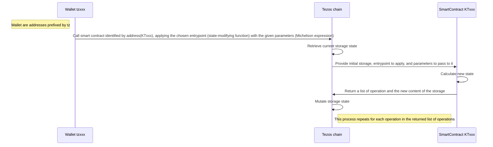

# Intezos

To follow this tutorial, create a new repo. The full correction code can be found in the `contracts_final` folder.

## Goal 
Transfer crypto currency throught [interac e-transfer](https://www.interac.ca/en/consumers/products/interac-e-transfer/) process, using a secret question.
You send tokens to someone and lock them with a couple of question/answer. The declared receiver can then claim the tokens by providing the answer, or you can redeem the tokens.

## Technologies
WebApp : Using TypeScript (and your favorite framework)
Contract : Using Ligo

# 1. Setup
## You will learn
- What tools to use: Ligo, Taqueria, Taquito, and `octez-client`
- How to create a starter repository
- How to initialize a contract

## Installation
### Install [`octez-client`](https://docs.tezos.com/developing/octez-client/installing)
You can download the `octez-client` binary either directly from [the Tezos repo](https://gitlab.com/tezos/tezos/-/packages/13480737) or using [a package manager](https://docs.tezos.com/developing/octez-client/installing).

### Install [Node.js and npm](https://docs.npmjs.com/downloading-and-installing-node-js-and-npm)
Useful to develop your webapp, also used by Taqueria.

### Install [Ligo](https://ligolang.org/docs/intro/installation?lang=jsligo)
[Ligo](https://ligolang.org/docs/intro/introduction?lang=jsligo) is a high-level strongly typed programming language that allows writing contracts for the Tezos blockchain, testing them, and compiling them to [Michelson](https://www.michelson.org/), the low-level language that executes on the [Tezos](https://tezos.com/) blockchain. 

### Install [Taqueria](https://taqueria.io/docs/getting-started/installation/)
[Taqueria](https://taqueria.io/) improves development experience by managing the development lifecycle.

### Vscode plugin
We recommend using [Ligo vscode plugin](https://marketplace.visualstudio.com/items?itemName=ligolang-publish.ligo-vscode).

---
## Startup

```shell
taq init
```

A taq'ified folder contains the following subfolders:
- `.taq` contains [Taqueria](https://taqueria.io/docs/) configuration files are;
- `artifacts` is where your compiled [Michelson](https://tezos.gitlab.io/active/michelson.html) will be generated;
- `contracts` is where your contracts sources have to be.

---
## Initializing your first contract :
To plug taqueria with ligo let's install a plugin : 
```shell
taq install @taqueria/plugin-ligo
```
[The Ligo plugin for Taqueria](https://taqueria.io/docs/plugins/plugin-ligo/) provides tasks to work with Ligo smart contracts such as compiling and testing.
Run  
```shell
taq create contract intezos.jsligo
```  
It should generate a file in contracts named `intezos.jsligo` filled with a template for a smart contract counter where 3 action are available :
- `Increase`,
- `Decrease`,
- `Reset`.

🚧 Taqueria is not up to date and this provided template is obsolete. The new one will be the code below, that should should copy paste into your `intezos.jsligo` file. 🚧
```typescript
/*
 A type storage, representing stored data in you SC(smart contract)
*/
type storage = int;

/*
An entry-point is a pure function that can be formalized as :
[list<operation>, storage] = f(parameter, storage)
where :
- f is the entry-point function that is called
- parameter contains the inputs that are sent by the caller when the contract is called
- storage is the state of the storage. The input is the current state of the storage, and it outputs the next state
- list<operation> is a list of commands that will be executed by the block chain (for instance transfers…)

Entrypoint are tag with the keyword @entry
*/


@entry
const increment = (delta : int, store : storage) : [list<operation>, storage] =>
// Empty list mean there is no other invokation, the second element is the new state of the storage
  [list([]), store + delta];

@entry
const decrement = (delta : int, store : storage) : [list<operation>, storage] =>
  [list([]), store - delta];

/* 
The unit type in Michelson or LIGO is a predefined type that contains only one value that carries no information. It is used when no relevant information is required or produced.

Also _ which can be used as prefix of variable name like on _parameter, explain to compiler than this value is not used later. 
*/
@entry
const reset = (_parameter : unit, _storage : storage) : [list<operation>, storage] =>
  [list([]), 0];
```

Let's focus a bit on `unit` to bring a key notion of JSLigo and smart contract. 
In JsLIGO, the unique value of the `unit` type is `[]`.
It can be used similarly to the void/null types from other languages (e.g. as the return type of a function that does not return anything), but has a slightly different interpretation: it is considered as a defined value.
A smart contract is a pure state machine without side effect. Possible state transitions are represented by functions called entrypoints that take in the current state along with some parameters, and return a new state. These transitions can then be applied (by anyone, unless specific precautions are taken) to change the state of the contract on the blockchain.



There are two main uses of `unit`:
  - an entrypoint whose parameter type is `unit` is simply an entrypoint that does not take any argument; and
  - a contract with storage type `unit` is a contract that does not store anything.

# 2. First iteration on Intezos
## You will learn
- In Ligo, you will learn how to : 
  - Manage your storage, entrypoint and parameters
  - Use assertions in code
  - Execute an operation (namely transfer XTZ to a wallet)
  - `<>` operator for genericity 
  - Use built-in function
  - What is `balance` and `source` of a contract
  - What is `sender` and `amount` of an operation
  - Write and execute a test
  - Split your code
-  With taqueria, you will learn how to:
  - Deploy a contract through Taqueria
  - Simulate an execution
- On tezos, you will learn how to:
  - Import key generated by Taqueria onto `octez-client`
  - Invoke contract with `octez-client`
  - Use explorers

## Scope
Originate a contract containing X amount of XTZ which can be claimed or redeemed, secured with question and answer.
- Claim: If you are the declared receiver you can ask your XTZ by invoking claim endpoint with the passphrase as parameter
- Redeem: If you are the originator (creator of the SC) and the amount has not been claimed, you can redeem it.

## Cleaning to start a new project
We will start Intezos from scratch so remove the generated template in `intezos.jsligo`.

## Defining the storage

We will now define the storage type of our contract. Storage is the data stored in your smart-contract, on the blockchain. When deploying your contract, you will pay for the space required by the storage, so keep it as light as possible and only use it only for data that profits from being on the blockchain.

```typescript
type storage = { 
  amount: tez, // The transferred amount (xtz)
  sender: address, // Address of the sender (tzxxx)
  receiver: address, // Address of the recipient (tzxxx)
  question: string, // Question that the receiver needs to answer
  encrypted_answer: string, // The expected answer
  pending: bool // Can the funds still be claimed or redeemed?
};
```

As you can see storage is defined through a type. for better comprehension it's possible to group properties into another type

```typescript
type secret = {
  question: string, // Question that the receiver needs to answer
  encrypted_answer: string // The expected answer
};

type storage = { 
  amount: tez, // The transfered amount (xtz)
  sender: address, // Address of the sender (tzxxx)
  receiver: address, // Address of the recipient (tzxxx)
  secret: secret, // Type secret
  pending: bool // Can the funds still be claimed or redeemed?
};
```

Now that the storage is defined, we want to interact with it by executing some invokable code on the blockchain. 
 
## Defining an entrypoint

Let's create a first entrypoint that switches the `pending` value to `false` when `claim` has been invoked :
```typescript
@entry
const claim = (_: unit, store: storage): [list<operation>, storage] => {
  return [list([]), {...store, pending: false}]
};
```
We use an annotation `@entry` to declare the method as a contract entrypoint, and it has two arguments:
- The first argument represents the parameters passed to the entrypoint, `_ : unit` here because we don't manage any parameter for now.
- The second argument `store : storage` is the state of the storage before execution of the script.
This entrypoint returns a pair containing:
- an empty list of operation `list([]) : list<operation>`; and
- a copy of the current state `store` with the `pending` field set to `false`.

Because the compiler can't infere list([]) as list<operation> alone. 

Note: The compiler can not infer what type the empty list has, and we therefore have to help it, either by specifying the return type of the entrypoint `[list<operation>, storage]` as done above, or by using `list([]) as list<operation>` in place of `list([])`.


### Checking that the code compile
When you compile using the `ligo` command, it'll produce a corresponding Michelson (langage understood by the Tezos blockchain) program on the standard output:
```shell
ligo compile contract contracts/intezos.jsligo 
```
To save the produced code, use `-o` flag
```shell
ligo compile contract contracts/intezos.jsligo -o artifacts/intezos.tz
```
Now you can open the `artifacts/intezos.tz` file and see the produced Michelson is.

It is also possible to use Taqueria :
```shell
taq compile intezos.jsligo
```

### Simulating execution to test the contact

To simulate your contract, you need to initialize the context (here, the storage) and prepare call simulation, with an entrypoint and its parameters. 

With `ligo run dry-run` we will provide an input state (storage), an action to perform (entrypoint and parameters). Then the Ligo compiler, using a Michelson-interpreter, will generate the output state.

```shell
ligo run dry-run contracts/intezos.jsligo 'unit' '{ amount: 100000 as mutez, receiver: "tz1Yj4FviaKEy6ER8ZDeiH2w2Lx8bapjuJEq" as address, secret: { question: "Do you like Paul", encrypted_answer: "yes he is awesome but encrypted" }, sender: "tz1Yj4FviaKEy6ER8ZDeiH2w2Lx8bapjuJEq" as address, pending: true }' --entry-point claim
```
Will generate an output state :
```lisp 
( LIST_EMPTY() ,
  record[amount -> 100000mutez ,
         pending -> False(unit) ,
         receiver -> @"tz1Yj4FviaKEy6ER8ZDeiH2w2Lx8bapjuJEq" ,
         secret -> record[encrypted_answer -> "yes he is awesome but encrypted" ,
                          question -> "Do you like Paul"] ,
         sender -> @"tz1Yj4FviaKEy6ER8ZDeiH2w2Lx8bapjuJEq"] )
```
Where :
- `LIST_EMPTY()`is a list of operations to apply (here empty because we return `list([])`)
- `record` is the new state of your storage.

As you can see, in the command, the state of initial storage is `pending: true`, and in the output, it has been changed to `pending -> False(unit)` as expected.

Using `ligo run dry-run` like this is a bad user experience :
- the command is not readable;
- editing the storage (or parameters) is painful;
- you need to type the command in one line; and
- to re-execute a dry-run you have to find the good command in your bash history.  
 
Let's do some software engineering to have a better way to run dry-run. 

Create a new file `intezos.runner.jsligo` it will be a wrapper around your test used to declare some tests data.
```typescript
// Start by integrating intezos.jsligo into your runner
#include "./intezos.jsligo"

// Then define a constant corresponding to your initial storage
const default_storage: storage =
  {
    amount: 100000 as mutez,
    receiver: "tz1Yj4FviaKEy6ER8ZDeiH2w2Lx8bapjuJEq" as address,
    secret: {
      question: "Do you like Paul",
      encrypted_answer: "yes he is awesome but encrypted"
    },
    sender: "tz1Yj4FviaKEy6ER8ZDeiH2w2Lx8bapjuJEq" as address,
    pending: true
  };

```
Now you can trigger your dry-run like this :
```shell
ligo run dry-run contracts/intezos.runner.jsligo 'Claim(unit)' 'default_storage'
```

### Implements the conditions

Now we want to implement the condition. 
Rules to process the transfer : 
- The state is pending
- The operation emitter is the identified receiver
- The operation contain an arg with the answer which have to be the same as the one stored.
Expressed with if statement :
```typescript
/* To be clean, create a type claim_parameter which contain the string */
type claim_parameter = { answer: string };

/* And pass it as parameter (first argument) */
@entry
const claim = (parameter: claim_parameter, store: storage): [list<operation>, storage] => {
  if(store.pending && Tezos.get_source() == store.receiver &&
      parameter.answer == store.secret.encrypted_answer)
      {
        // ...store is the spread operator like in typescript
        // that's mean in { ...store, pending: false }  all properties of the record store, but we replace pending with the value false.
    return [list([]), { ...store, pending: false }]
  }else
  {
    return [list([]), store]
  }
};
```

Edit the `intezos.runner.jsligo` file
```typescript
const claim_default_parameter: claim_parameter =
  {
    answer: "yes he is awesome but encrypted"
  };

const claim_bad_answer_parameter: claim_parameter =
  { answer: "no" };
```

Then you can dry-run : 
```shell
ligo run dry-run contracts/intezos.runner.jsligo 'Claim(claim_default_parameter)' 'default_storage'
```
Oh, the `pending` value is `true`, so the condition is evaluate to `false` !
Yes because you are on dry-run, so the context provided by the blockchain doesn't exist
`Tezos.get_source()` return arbitrary contract.
There is 4 values provided by tezos : 
- `amount` : the amount provided by the transaction
- `balance` : the amount owned by the contract
- `sender` : the address which trigger the transaction (can be a smart contract, addres of smart contract are prefixed by `KT` )
- `source` : the wallet who originate the contract (can only be a wallet, address of wallet are prefixed by `tz`)

Now we want to mock source value, to do it you can use the flag `--source`

```shell
ligo run dry-run contracts/intezos.runner.jsligo 'Claim(claim_default_parameter)' 'default_storage' --source 'tz1Yj4FviaKEy6ER8ZDeiH2w2Lx8bapjuJEq'
```
Now you can see the state mutation !

That's a first step but we can improve it with `assert` statement, the code is elegant and less expensive, for deployer and customer and can fail during the simulation instead of execution :
```typescript
@entry
const claim = (parameter: claim_parameter, store: storage): [list<operation>, storage] => {
  assert(
    store.pending && Tezos.get_source() == store.receiver &&
      parameter.answer == store.secret.encrypted_answer
  );
  return [list([]), { ...store, pending: false }]
};
```

You can test it with `dry-run` learned before !

### Encrypt the answer
Because you are on a blockchain, [your storage is visible by everyone](https://ghostnet.tzkt.io/KT1WxYSBYLPrACzGgFM7dGquM5u28rx1WtVU/storage/).
To hide it let's use the magic of Encryption, we gonna use the core library [Crypto](https://ligolang.org/docs/next/reference/crypto-reference/?lang=jsligo)

Let's create the function encrypt 
```typescript
/* 
Crypto.sha256 is typed as follow let sha256: (b: bytes) => bytes 
So you need to transform your string into byte, and also edit your storage encrypted_answer type with bytes
*/

type secret = {
  question: string,
  encrypted_answer: bytes
};


const encrypt = (value) => Crypto.sha256(Bytes.pack(value));

```
Now you can use it into your assert condition
```java
assert(
    store.pending && Tezos.get_source() == store.receiver &&
      encrypt(parameter.answer) == store.secret.encrypted_answer
  );
```

Don't forget to edit the `default_storage` to be able to `dry-run` :
```typescript
encrypted_answer: Crypto.sha256(Bytes.pack("yes he is awesome but encrypted")),
```

Congrats, the secret is now offuscated.

### Implements the transfer

Like mentioned before, entries are a pure state machine without side effect so by returning the new status of the storage, your smart contract describe a new state but didn't mutate it, that's the role of the chain. 

That's the same things for operations. In output you can describe another operation which have to be executed by the chain but didn't invoke it directly, orchestration is done by the chain. 

So to do a transfer, we need to describe and return a new [transaction](https://ligolang.org/docs/next/reference/current-reference?lang=jsligo).

First thing is to find the wallet on the chain. In tezos, a wallet is a special contract so to find it, you can search the contract defined by the address with `Tezos.get_contract_opt`. 

Defined as :
```ocaml
let get_contract_opt : (a: address) => option<contract<'param>>
```

As you can see it's suffixed by _opt (option). It's the [Some None pattern](https://ligolang.org/docs/next/language-basics/unit-option-pattern-matching/?lang=jsligo#optional-values). 

Some and None are two [Variant](https://ligolang.org/docs/next/language-basics/unit-option-pattern-matching/?lang=jsligo#variant-types) which can be processed using [pattern matching](https://ligolang.org/docs/next/language-basics/unit-option-pattern-matching/?lang=jsligo#variant-types) a common pattern in functionnal programming.

```typescript
/* 
Find the wallet from the address and if the address exist return it. 
If not interrupt the execution of the smart-contract.
*/

  const receiverAddress = match
    (Tezos.get_contract_opt(store.receiver))
    {
      when(Some(contract)): contract
      when(None()): failwith("Not an existing address")
    };

  /* Create operation describing the transfer of the amount into the wallet
  Like explained in doc, To indicate an account, use unit as first parameter.
  */
  const transferOperation: operation =
    Tezos.transaction(unit, store.amount, receiverAddress);
  /* And return the operation which gonna be executed by the chain, with the mutation of the store */
  return [list([transferOperation]), { ...store, pending: false }]
```

We will need to find a wallet for redeem entry to, let's factorize it a bit using generic :
```typescript
/* To define a generic function use diamond operator '<>' */
const get_instanced_address_or_fail = <t>(address) =>
  match
    /* To help the compiler here, you need to declare `as option<contract<t>>` */
    (
      Tezos.get_contract_opt(address) as option<contract<t>>
    )
    {
      when(Some(contract)): contract
      when(None()): (failwith("Not an existing address"))
    };
```
Now you can simplify claim entrypoint with :
```typescript
const transferOperation: operation =
  Tezos.transaction(unit, store.amount, get_instanced_address(store.receiver));
return [list([transferOperation]), { ...store, pending: false }]
```
So now you can use `get_instanced_address_or_fail` to get a wallet or a contract !

If you `dry-run` you'll see something like :
```lisp
( CONS(Operation(0135a1ec49145785df89178dcb6e96c9a9e1e71e0a00000001a08d0600008f8d059db9a174e7fadb94687fefa70551ee8adf00) ,
       LIST_EMPTY())
```
Michelson representation of an operation !

### Deploy it on the testnet : 

To test our contract through blockchain, we gonna deploy it on [Ghostnet testnet](https://tezos.gitlab.io/introduction/test_networks.html#ghostnet)

Using [Taqueria](https://taqueria.io/docs/plugins/plugin-taquito/#the-taq-deploy-task) to compile the code and the initial storage. Now taqueria use the file `intezos.storageList.jsligo` to compile storage, so copy and paste storage declaration from `intezos.runner.jsligo` into `intezos.storageList.jsligo` and run :
```bash
taq compile intezos.jsligo
```
Before to deploy it, you'll need to install taqueria plugins : 
Run :
```shell
taq install @taqueria/plugin-taquito
```

Then you will be able to deploy
```bash
taq deploy intezos.tz --mutez 100000  --storage intezos.default_storage.tz --env testing 
```
Where :
- `intezos.tz` is the compiled smart contract
- `--mutez 100000` is the number of mutez transmit to the contract (same as the amount in the storage)
- `--storage intezos.default_storage.tz` is the compiled initial storage to use
- `--env testing` defined in `.taq/config.json` is `ghostnet` 

After execution : 
```bash
A keypair with public key hash tz1PMrwFepZWiJgoFrdJe1F4ob7erngsPEPp was generated for you.
To fund this account:
1. Go to https://teztnets.xyz and click "Faucet" of the target testnet
2. Copy and paste the above key into the wallet address field
3. Request some Tez (Note that you might need to wait for a few seconds for the network to register the funds)
No operations performed
```

Taqueria has created a wallet for you, you can find the definition in `.taq/config.local.testing.json`. But your wallet is empty, fund it following instruction and retry :
```bash
taq deploy intezos.tz --mutez 100000  --storage intezos.default_storage.tz --env testing 
```

Your smart contract should be deployed ! Find the address on the output of the command and go see it on 
`https://ghostnet.tzkt.io/<CONTRACT_ADDRESS_KT1>`

### Invoke it : 

Now the smart contract is deployed invoke we gonna use `octez-client`
Begin by importing the wallet generated by `taqueria` in the `octez-client` using your private key stored in `.taq/config.local.testing.json`
```bash
octez-client import secret key taq_deployer unencrypted:<PRIVATEKEY>
```
Your endpoint need parameter, the parameter have to be valid michelson. You can use to compile your parameter
```bash
ligo compile parameter contracts/intezos.jsligo 'Claim({answer: "yes he is awesome but encrypted" })'
```
Result is a string, because a string value alone is a string in michelson, but if your parameter is complex, you should use the command

Then call the endpoint
```bash
octez-client --endpoint https://ghostnet.tezos.marigold.dev call <CONTRACT_ADDRESS_KT1> from taq_deployer --entrypoint claim --arg '"yes he is awesome but encrypted"'
```
Where :
- `--endpoint xxx` Is the RPC endpoint you will deal with. Marigold is a stable one
- `<CONTRACT_ADDRESS_KT1>` Is the address of your deployed contract
- `from taq_deployer` Is the alias of the wallet imported at precendent step
- `--entrypoint` is your contract entrypoin to invoke
- `--arg` is the parameter pass to your entrypoint 

Now check on `https://ghostnet.tzkt.io/<CONTRACT_ADDRESS_KT1>/operations/` you should see the operation !

You can also try with a failure : 
```bash
octez-client --endpoint https://ghostnet.tezos.marigold.dev call <CONTRACT_ADDRESS_KT1> from taq_deployer --entrypoint claim --arg '"no"'
```
Note that the command fail at simulation step, so this invokation doesn't consume fees

### Implement the redeem operation : 

You can use what you learned to implement `redeem` entrypoint. It can be redeem if the emitter of the transaction is the sender, and it's not already done.

Don't forget to return the operation and new storage.


# Next 
Congrats ! The next step will be to refactor the contract to make it reusable !
